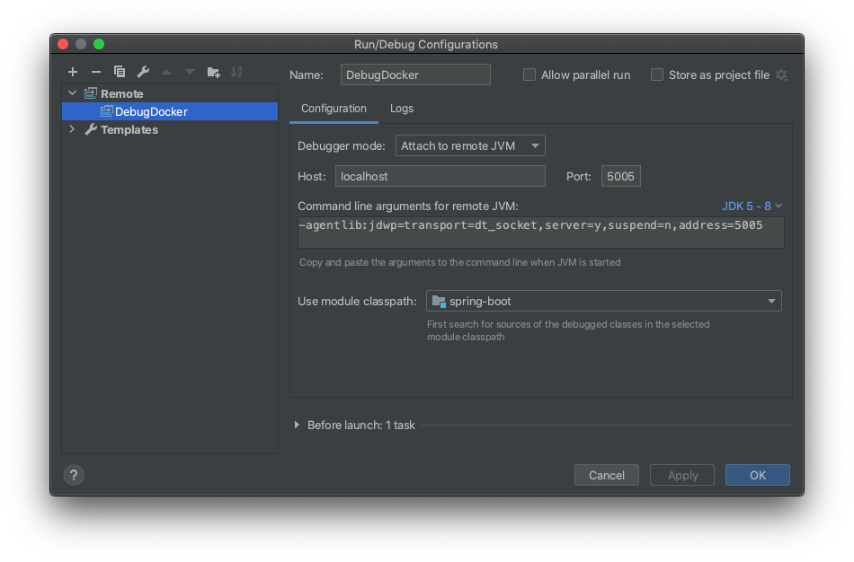

# Debug your Java application using Docker on IntelliJ

1. Create a sample SpringBoot application

   - Create a SpringBoot app using https://start.spring.io/
   - Open the SpringBoot app with intellij
   - Create a Rest endpoint `GreetingController`

2. Run the application using Docker

   - Initialise the `Dockerfile` and the `docker-compose.yml` files
   - Enable the debug agent and port in the docker configuration

     - Dockerfile

     ```
        ENV JAVA_TOOL_OPTIONS -agentlib:jdwp=transport=dt_socket,address=5005,server=y,suspend=n
     ```

     - docker-compose.yml

     ```
     - 5005:5005
     ```

   - Start the SpringBoot application with Docker compose

   ```
      docker-compose up --build
   ```

   - Call the rest endpoint

   ```
      http://localhost:8080/greeting
      http://localhost:8080/greeting?name=SpringBoot
   ```

3. Attach the debugger to the running Docker image
   - Create a remote deployment in Intellij 
   - Run the newly created config to attach the debugger to Docker
